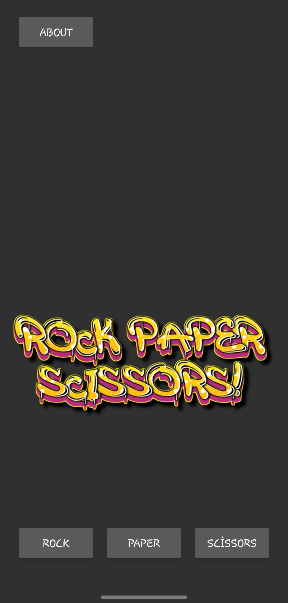
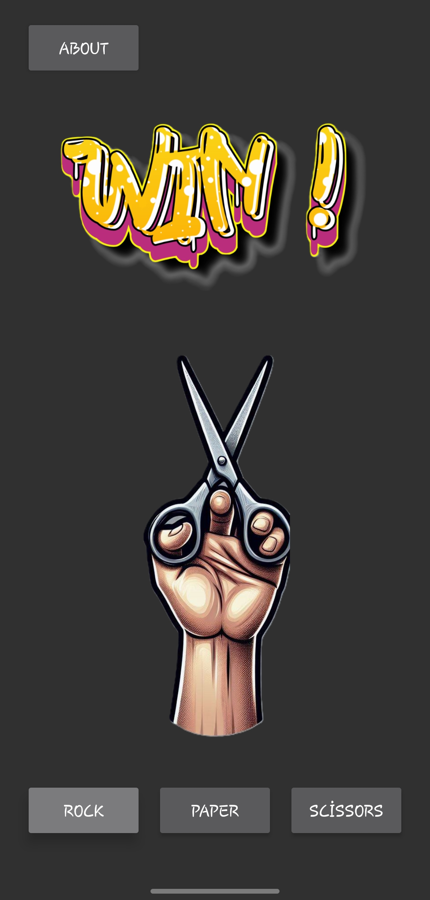
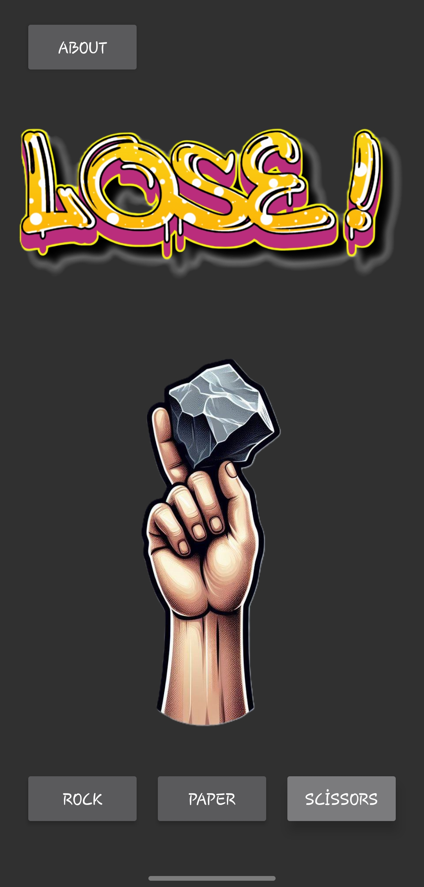
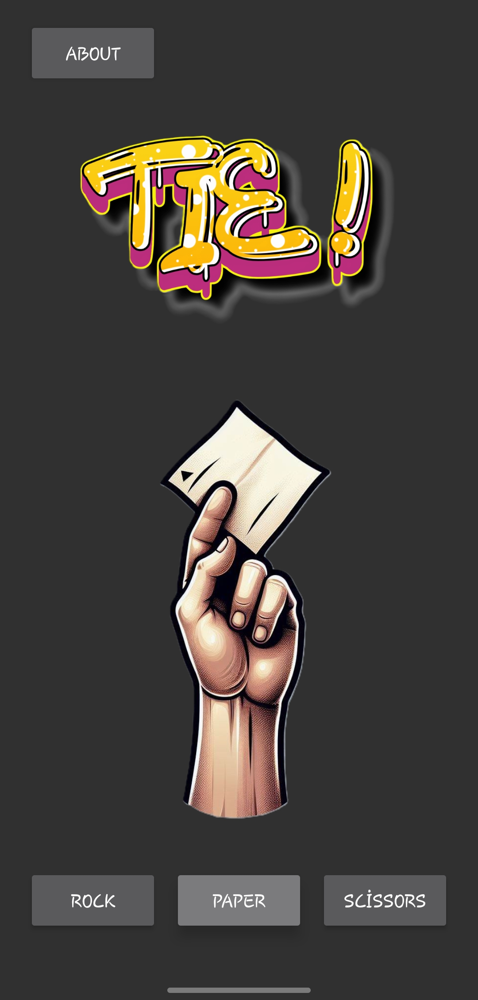
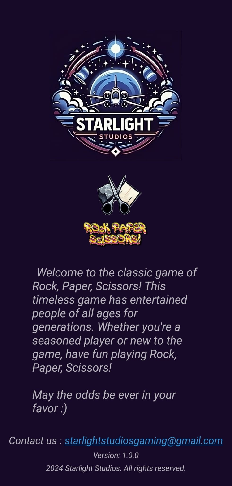

# RockPaperScissorsAndroid
#######################################################################################
# Welcome to the classic game of Rock, Paper, Scissors!
### Kagan Yavuz
#

This timeless game has entertained people of all ages for generations.  Whether you're a seasoned player or new to the game, have fun playing Rock, Paper, Scissors!

May the odds be ever in your favor :)

#
RockPaperScissorsAndroid is a simple Rock-Paper-Scissors game application for Android, developed using Xamarin.

# Installation
To build and run this application, you need to have Xamarin and Visual Studio installed.

1- Clone the repository

2- Open the solution file (.sln) in Visual Studio.

3- Restore the NuGet packages and build the solution.

4- Deploy the application to an Android device or emulator.

When the app is launched, on the main game screen, you can choose Rock, Paper, or Scissors by clicking the respective buttons.

The app will randomly select Rock, Paper, or Scissors and display the result of the game (win, lose, tie).

You can navigate to the About page by clicking the "About" button. The About page shows the app version and contact email.

On the About page, you can click the email address to compose an email.

# Screenshots

<table>
  <tr>
    <td></td>
    <td></td>
    <td></td>
    <td></td>
    <td></td>
  </tr>
</table>

#

Version: 1.0.0

Thank you,

Kagan Yavuz
